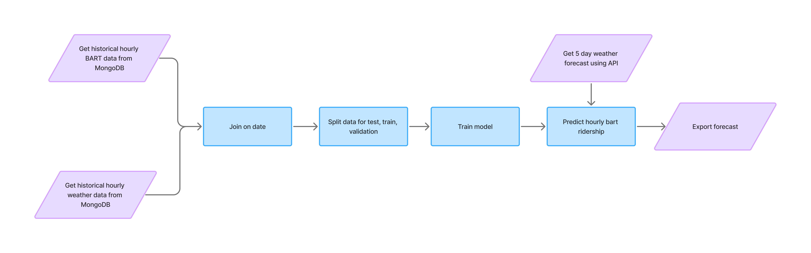
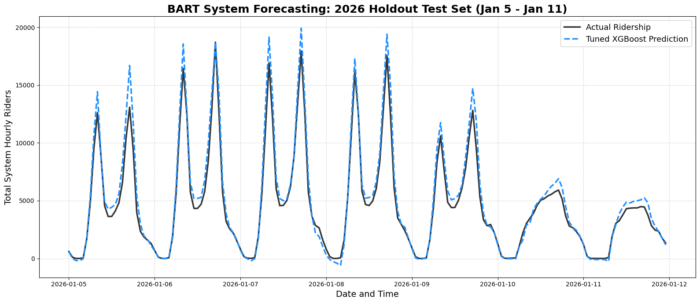
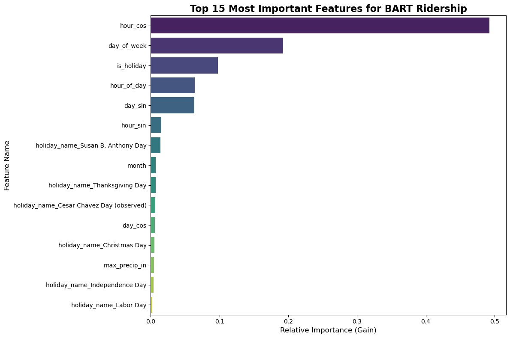

# [Bart Hourly Ridership Forecast]

> As a Master of Data Science and AI student at the University of San Francisco, I have been exploring the predictive capabilities of different machine learning models. I became curious about whether I could apply these learnings to build a predictive pipeline for BART ridership, given its importance in the daily lives of so many Bay Area residents including myself.

## Table of Contents

- [Pipeline Overview](#pipeline-overview)
- [Model Selection](#model-selection)
- [Findings](#findings)
- [Try It Yourself](#try-it-yourself)
- [Next Steps](#next-steps)

## Pipeline Overview

I sourced 2023–2026 BART hourly ridership data directly from their [official website](https://www.bart.gov/about/reports/ridership). The raw data is broken down by station, but for this project, I focused on aggregating the hourly ridership across the entire transit system. I also pulled historical hourly weather data using [WeatherAPI](https://www.weatherapi.com) to evaluate if weather factors could provide a more accurate forecast.



I chose MongoDB to store the data because it allowed for (1) highly efficient querying of large datasets and (2) easy merging of ridership and weather data by hour and date via an aggregation pipeline. 

From there, I split the data chronologically: 2023–2024 served as the training set, 2025 as the validation set, and 2026 data was held out entirely as the test set.

Once the model finished training, I saved the finalized weights as a `.joblib` file. In production, an Apache Airflow DAG orchestrates the pipeline, generating an updated 5-day hourly ridership forecast every morning. The final predictions are then uploaded and stored in a Google Cloud Storage bucket.

## Model Selection

Using a traditional auto-regressive time series model (like ARIMA) initially seemed like the obvious choice, given that ridership patterns are highly temporal and exhibit regular seasonality. However, official BART hourly ridership data is not published until a full month has passed. This data lag presents a critical issue, as traditional time series models are most powerful when predicting the immediate next steps of an existing, up-to-date sequence.

As an alternative, I framed this as a supervised machine learning problem using an **XGBoost Regressor**. Gradient boosted trees are highly powerful for capturing complex, non-linear patterns with a lower risk of overfitting compared to deep neural networks. Because XGBoost is purely mathematical and cannot inherently "understand" time, I utilized heavy feature engineering to cyclically encode temporal parameters (like hour of day and day of week) so the model could naturally learn these relationships.

## Findings

The final XGBoost model achieved a Weighted Mean Absolute Percentage Error (WMAPE) of **15%** on the unseen test set.



Looking at a weekly snapshot of the test data, the model successfully captured the overall cyclical shape of Bay Area transit but tended to overestimate ridership, particularly during the daily peak rush hours.



By extracting the model's feature importance weights, I found that weather did not have a strong influence on baseline hourly ridership. A logical explanation is that core commuters rely on public transportation to reach work or school regardless of the weather, and the Bay Area has a relatively mild, consistent climate year-round.

Instead, `hour_cos` was the most important feature by far. This feature was engineered to cyclically encode the hour of the day, unsuprisingly proving that the clock and the calendar dictate the vast majority of human transit behavior.

## Try It Yourself

If you are interested in setting up a recurring, 5-day hourly ridership forecast on your own machine, you can do so by following these steps:

### Clone the Repository

```bash
git clone https://github.com/lintyfresh/Bart_Hourly_Ridership_Forecast.git
cd Bart_Hourly_Ridership_Forecast
```

### Environment Variables

Create a `.env` file in the project root with:

```text
GCP_SERVICE_ACCOUNT_KEY=your_key_here
GCP_BUCKET_NAME=your_bucket_name_here
WEATHER_KEY=your_weather_api_key_here
```

### Setup

1. Save `.joblib` files to your GCP bucket.
2. Move `bart_prediction_dag.py` to `~/airflow/dags/` folder
3. Start Airflow standalone and unpause the DAG in the web UI

## Next Steps

Building upon this initial pipeline, I plan on implementing the following:

- [ ] Transition from a system-wide forecast to a hierarchical model that predicts hourly ridership at the individual station level, evaluating if aggregating station-level predictions yields higher overall accuracy.

- [ ] Connect the output GCS bucket to a web dashboard to visually represent the 5-day forecast in real-time.